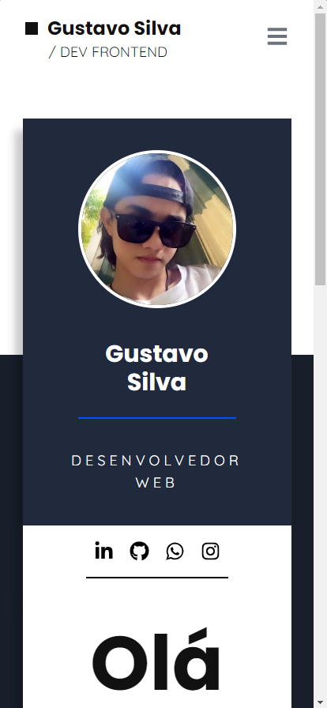
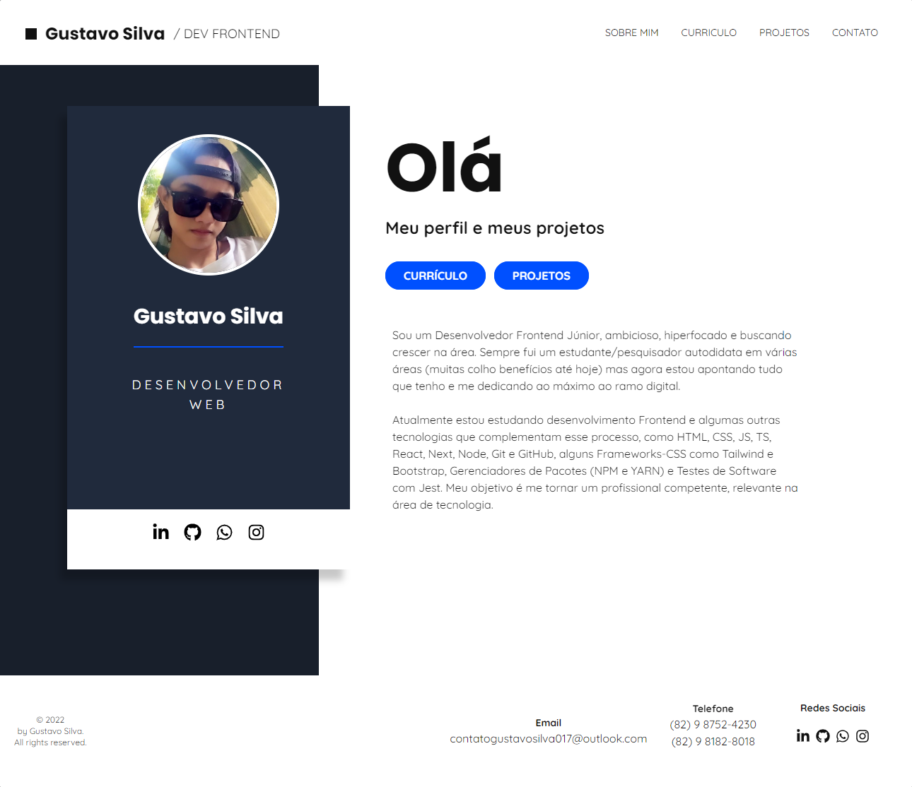

# Portfolio-GugaSilva
 

<h2>Table of contents</h2>

- [Overview](#overview)
  - [The project](#the-project)
  - [Screenshot](#screenshot)
  - [Links](#links)
- [My process](#my-process)
  - [Built with](#built-with)
  - [What I learned](#what-i-learned)
- [Author](#author)

<h2 id="overview"><strong>« [Overview] »</strong></h2>
 

<h3 id="the-project"><strong>The Project</strong></h3>
 

<h3 id="screenshot"><strong>Screenshot</strong></h3>

• Mobile Layout Preview

• Web Layout Preview

<h3 id="links"><strong>Links</strong></h3>
 

- Live Site URL: [Click-me](https://portfolio-guga-silva.vercel.app/)

- Production #01: [Click-me](https://portfolio-guga-silva-pazfk9mlu-gugas1lva.vercel.app/)

- Production #02: [Click-me](https://portfolio-guga-silva-7ydhxl1hd-gugas1lva.vercel.app/)

<h2 id="my-process"><strong>« [My Process] »</strong></h2>
 

<h3 id="built-with"><strong>Built With</strong></h3>

<h4>Front end</h4>

- HTML / CSS / JS / TypeScript
- ReactJS
- NextJS
- NodeJS
- Webpack

<h4>Framework JavaScript</h4>

- React
- React-Icons
- Styled-Components

<h4>Framework Web</h4>

- NextJS

<h4>Framework UI</h4>

- Tailwind-CSS
- MUI

<h4>Paas</h4>

- Vercel

<h4>CDN</h4>

- Cloudflare
- CDNJS

<h3 id="what-i-learned"><strong>What I Learned</strong></h3>
 <h2 id="author"><strong>« [Author] »</strong></h2>

